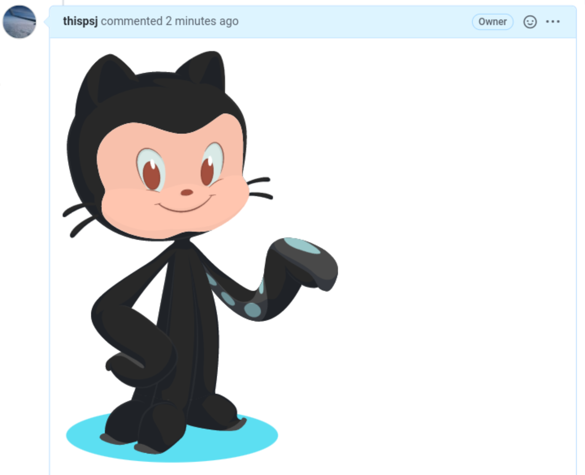
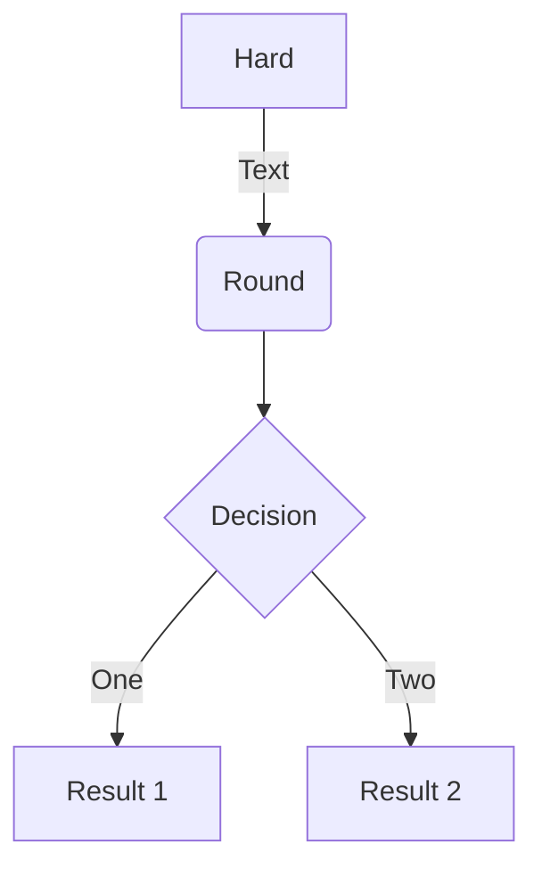
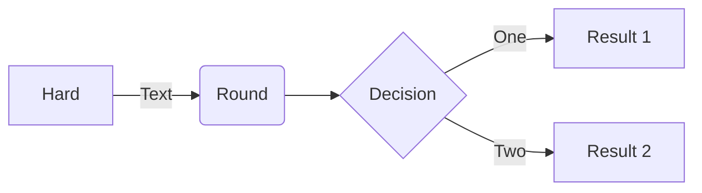
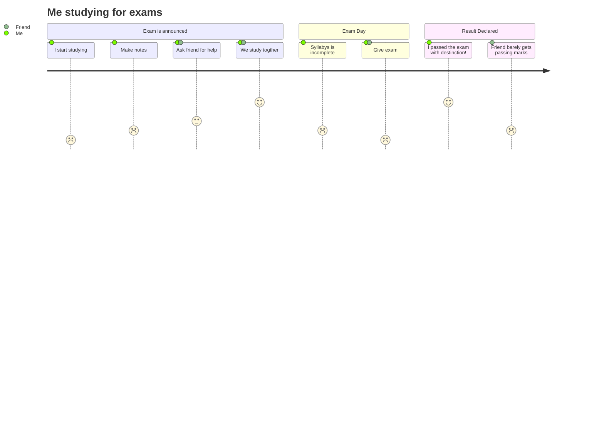
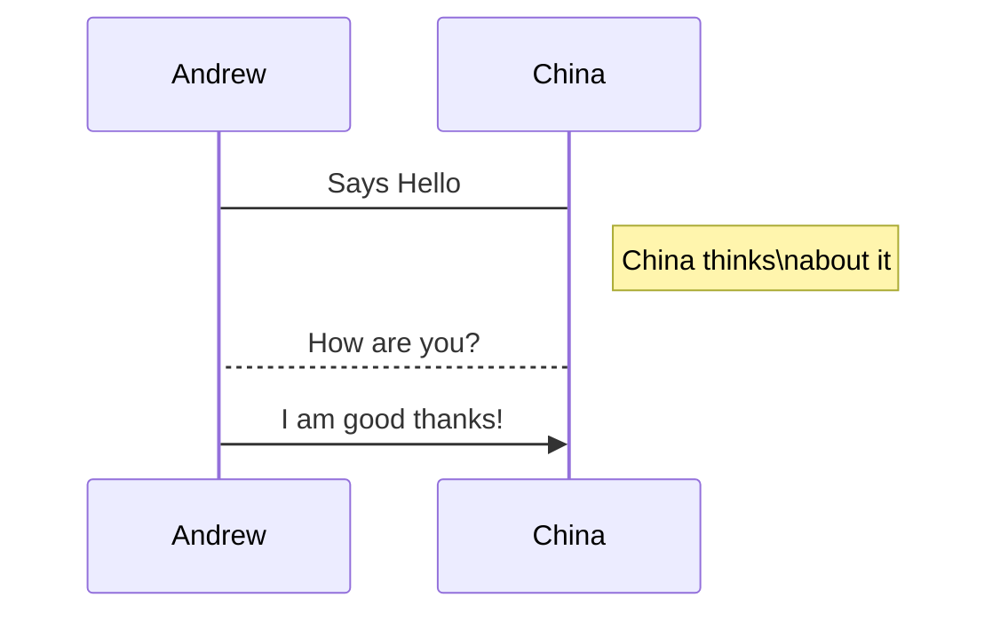
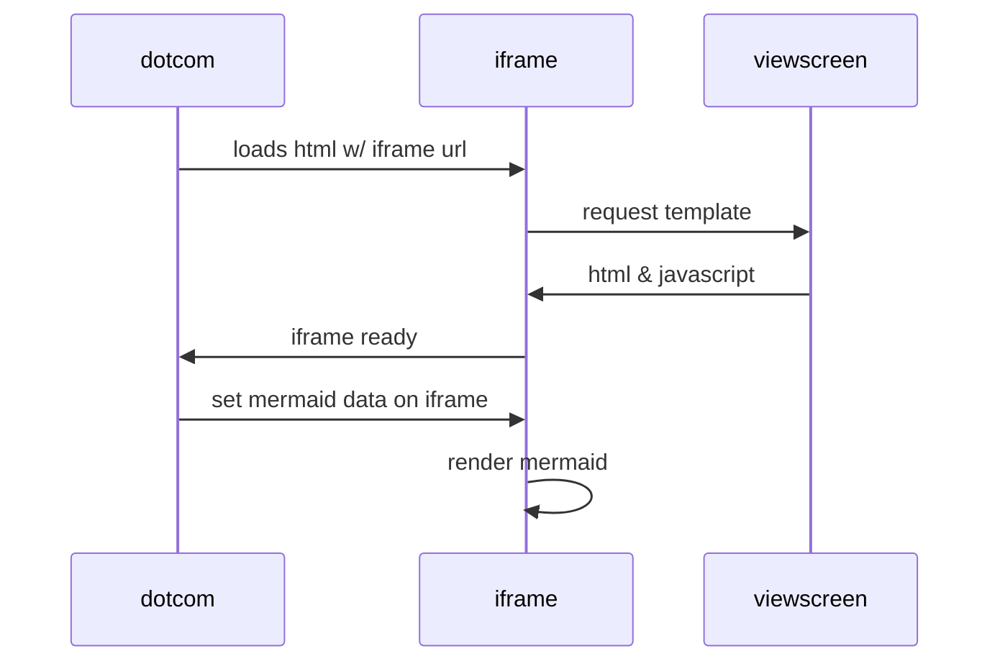
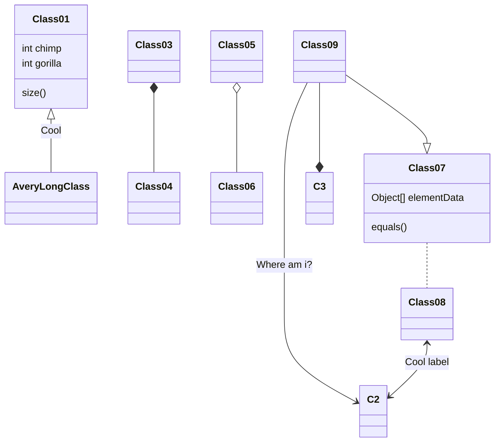
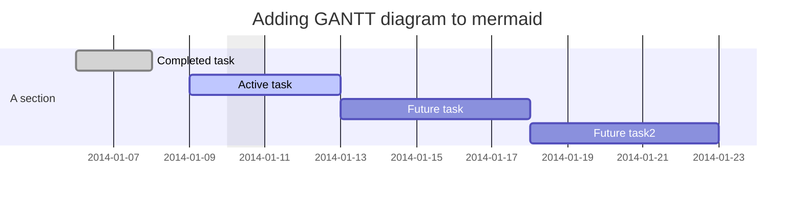
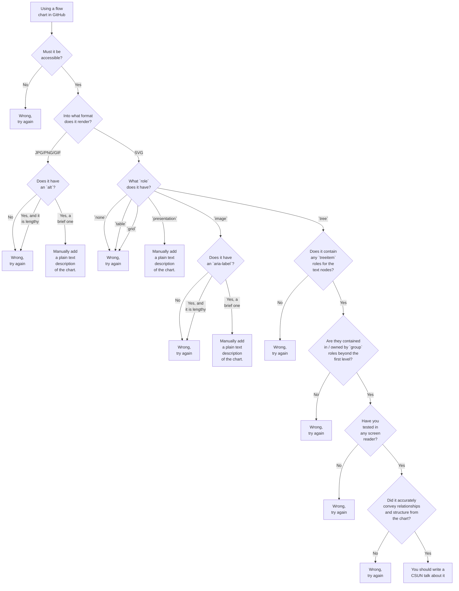

# Proyecto KIHEDOVI
## Módulo SeleccionEstudiante
### Descripción
El modúlo tiene como **objetivo** seleccionar un grupo o estudiante de un grupo.
Apellidos y nombres | Rol
------------------- | ---
Rubén Montes López | Dueño del producto
Raúl Matos Sanchez | Scrum Master


## EQUIPO DE DESARROLLO
Integrante | Apellidos y nombres de los integrantes del equipo de desarrollo (ordenado alfabéticamente)
---------- | ------------------------------------------------------------------------------------------
1 | nnn	
2 | nnn	
3	| nnn
4 | nnn	
5 | nnn	
6 | nnn	
### ÍTEM UNO
Historia de usuario detallada: HU002.
Identificador | HU002
------------- | -----
Nombre | aaaaaaaaaaaaaaaaaaaaaaaaaaaaaaaaaaaaaaaaaaaaaaaaaaaaaaaaaaaaaaaaaaaaaaaaaaaaaaaaaaaaaaaaaaaaaaaaaaaaaaaaaaaaaaaaaaaaaaaaaaaaa
Descripción | 	
Puntos de historia (días ideales) |	
Ítem | Criterios de aceptación	
1 |	
2 |	   
	
### Features

- Support Standard Markdown / CommonMark and GFM(GitHub Flavored Markdown);
- Full-featured: Real-time Preview, Image (cross-domain) upload, Preformatted text/Code blocks/Tables insert, Code fold, Search replace, Read only, Themes, Multi-languages, L18n, HTML entities, Code syntax highlighting...;
- Markdown Extras : Support ToC (Table of Contents), Emoji, Task lists, @Links...;
- Compatible with all major browsers (IE8+), compatible Zepto.js and iPad;
- Support identification, interpretation, fliter of the HTML tags;
- Support TeX (LaTeX expressions, Based on KaTeX), Flowchart and Sequence Diagram of Markdown extended syntax;
- Support AMD/CMD (Require.js & Sea.js) Module Loader, and Custom/define editor plugins;

# Editor.md


     


**Table of Contents**

[TOCM]

[TOC]

# H1 header
## H2 header
### H3 header
#### H4 header
##### H5 header
###### H6 header
# Heading 1 link [Heading link](https://github.com/pandao/editor.md "Heading link")
## Heading 2 link [Heading link](https://github.com/pandao/editor.md "Heading link")
### Heading 3 link [Heading link](https://github.com/pandao/editor.md "Heading link")
#### Heading 4 link [Heading link](https://github.com/pandao/editor.md "Heading link") Heading link [Heading link](https://github.com/pandao/editor.md "Heading link")
##### Heading 5 link [Heading link](https://github.com/pandao/editor.md "Heading link")
###### Heading 6 link [Heading link](https://github.com/pandao/editor.md "Heading link")

## Headers (Underline)

H1 Header (Underline)
=============

H2 Header (Underline)
-------------

### Characters
                
----

~~Strikethrough~~ <s>Strikethrough (when enable html tag decode.)</s>
*Italic*      _Italic_
**Emphasis**  __Emphasis__
***Emphasis Italic*** ___Emphasis Italic___

Superscript: X<sub>2</sub>，Subscript: O<sup>2</sup>

**Abbreviation(link HTML abbr tag)**

The <abbr title="Hyper Text Markup Language">HTML</abbr> specification is maintained by the <abbr title="World Wide Web Consortium">W3C</abbr>.

### Blockquotes

> Blockquotes

Paragraphs and Line Breaks
                    
> "Blockquotes Blockquotes", [Link](http://localhost/)。

### Links

[Links](http://localhost/)

[Links with title](http://localhost/ "link title")

`<link>` : <https://github.com>

[Reference link][id/name] 

[id/name]: http://link-url/

GFM a-tail link @pandao

### Code Blocks (multi-language) & highlighting

#### Inline code

`$ npm install marked`

#### Code Blocks (Indented style)

Indented 4 spaces, like `<pre>` (Preformatted Text).

    <?php
        echo "Hello world!";
    ?>
    
Code Blocks (Preformatted text):

    | First Header  | Second Header |
    | ------------- | ------------- |
    | Content Cell  | Content Cell  |
    | Content Cell  | Content Cell  |

#### Javascript　

```javascript
function test(){
	console.log("Hello world!");
}
 
(function(){
    var box = function(){
        return box.fn.init();
    };

    box.prototype = box.fn = {
        init : function(){
            console.log('box.init()');

			return this;
        },

		add : function(str){
			alert("add", str);

			return this;
		},

		remove : function(str){
			alert("remove", str);

			return this;
		}
    };
    
    box.fn.init.prototype = box.fn;
    
    window.box =box;
})();

var testBox = box();
testBox.add("jQuery").remove("jQuery");
```

#### HTML code

```html
<!DOCTYPE html>
<html>
    <head>
        <mate charest="utf-8" />
        <title>Hello world!</title>
    </head>
    <body>
        <h1>Hello world!</h1>
    </body>
</html>
```

### Images

Image:




> Follow your heart.


> 图为：厦门白城沙滩 Xiamen

图片加链接 (Image + Link)：

[](https://pandao.github.io/editor.md/examples/images/7.jpg "李健首张专辑《似水流年》封面")

> 图为：李健首张专辑《似水流年》封面
                
----

### Lists

#### Unordered list (-)

- Item A
- Item B
- Item C
     
#### Unordered list (*)

* Item A
* Item B
* Item C

#### Unordered list (plus sign and nested)
                
+ Item A
+ Item B
    + Item B 1
    + Item B 2
    + Item B 3
+ Item C
    * Item C 1
    * Item C 2
    * Item C 3

#### Ordered list
                
1. Item A
2. Item B
3. Item C
                
----
                    
### Tables
                    
First Header  | Second Header
------------- | -------------
Content Cell  | Content Cell
Content Cell  | Content Cell 

| First Header  | Second Header |
| ------------- | ------------- |
| Content Cell  | Content Cell  |
| Content Cell  | Content Cell  |

| Function name | Description                    |
| ------------- | ------------------------------ |
| `help()`      | Display the help window.       |
| `destroy()`   | **Destroy your computer!**     |

| Item      | Value |
| --------- | -----:|
| Computer  | $1600 |
| Phone     |   $12 |
| Pipe      |    $1 |

| Left-Aligned  | Center Aligned  | Right Aligned |
| :------------ |:---------------:| -----:|
| col 3 is      | some wordy text | $1600 |
| col 2 is      | centered        |   $12 |
| zebra stripes | are neat        |    $1 |
                
----

#### HTML entities

&copy; &  &uml; &trade; &iexcl; &pound;
&amp; &lt; &gt; &yen; &euro; &reg; &plusmn; &para; &sect; &brvbar; &macr; &laquo; &middot; 

X&sup2; Y&sup3; &frac34; &frac14;  &times;  &divide;   &raquo;

18&ordm;C  &quot;  &apos;

## Escaping for Special Characters

\*literal asterisks\*

## Markdown extras

### GFM task list

- [x] GFM task list 1
- [x] GFM task list 2
- [ ] GFM task list 3
    - [ ] GFM task list 3-1
    - [ ] GFM task list 3-2
    - [ ] GFM task list 3-3
- [ ] GFM task list 4
    - [ ] GFM task list 4-1
    - [ ] GFM task list 4-2

### Emoji mixed :smiley:

> Blockquotes :star:

#### GFM task lists & Emoji & fontAwesome icon emoji & editormd logo emoji :editormd-logo-5x:

- [x] :smiley: @mentions, :smiley: #refs, [links](), **formatting**, and <del>tags</del> supported :editormd-logo:;
- [x] list syntax required (any unordered or ordered list supported) :editormd-logo-3x:;
- [x] [ ] :smiley: this is a complete item :smiley:;
- [ ] []this is an incomplete item [test link](#) :fa-star: @pandao; 
- [ ] [ ]this is an incomplete item :fa-star: :fa-gear:;
    - [ ] :smiley: this is an incomplete item [test link](#) :fa-star: :fa-gear:;
    - [ ] :smiley: this is  :fa-star: :fa-gear: an incomplete item [test link](#);
            
### TeX(LaTeX)
   
$$E=mc^2$$

Inline $$E=mc^2$$ Inline，Inline $$E=mc^2$$ Inline。

$$\(\sqrt{3x-1}+(1+x)^2\)$$
                    
$$\sin(\alpha)^{\theta}=\sum_{i=0}^{n}(x^i + \cos(f))$$
                
### FlowChart







### Sequence Diagram
                    




### End	
	
Here is a simple flow chart:







